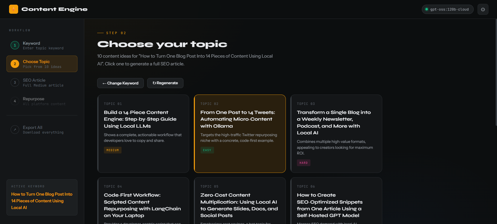

# 🤖 Local AI Tools

> A growing collection of free, browser-based AI tools powered by [Ollama](https://ollama.com).
> No API keys. No subscriptions. No data leaving your machine.


---

## 🧰 Tools Available

| # | Tool | Description |
|---|------|-------------|
| 01 | [Content Engine](https://github.com/learn-with-santosh/local-ai-tools/tree/main/content-engine) | Keyword → SEO Article → 14+ platform content pieces |
| 02 | *Coming soon* | — |
| 03 | *Coming soon* | — |

---

## ⚡ 01 — Content Engine

> **One keyword. One article. 14+ content pieces. Zero cost.**

A complete AI-powered content pipeline for creators, bloggers, and developers who want to grow on Medium, Twitter/X, LinkedIn, Pinterest, and YouTube — without paying for expensive AI subscriptions.

### What it does

```
Your Keyword
    │
    ▼
┌─────────────────────────────┐
│   10 SEO Topic Suggestions  │  ← Ranked by search demand & viral potential
└─────────────────────────────┘
    │  You pick one
    ▼
┌─────────────────────────────┐
│   Full SEO Article (900-    │  ← Medium-ready, streams in real time
│   1200 words)               │
└─────────────────────────────┘
    │  One click repurpose
    ▼
┌──────────┬──────────┬───────────┬────────────┐
│ 5 Tweets │ 3 LinkedIn│ 5 Pinterest│ YouTube    │
│ + Thread │ Posts     │ Pins       │ Short Script│
└──────────┴──────────┴───────────┴────────────┘
    │
    ▼
📥 Export everything as a single .txt file
```

### Screenshots

> 


### How to use

**Prerequisites — install Ollama**

```bash
# macOS / Linux
curl -fsSL https://ollama.com/install.sh | sh

# Windows → download from https://ollama.com
```

**Pull a model**

```bash
ollama pull llama3.2
```

**Start Ollama with CORS enabled**

```bash
OLLAMA_ORIGINS="*" ollama serve
```

**Open the tool**

```bash
# Clone this repo
git clone https://github.com/santoshshelar/local-ai-tools.git

# Open the tool in your browser
open local-ai-tools/content-engine/index.html

# Or on Windows
start local-ai-tools/content-engine/index.html
```

That's it. No npm install. No pip install. No `.env` file.

### Supported Models

| Model | RAM Required | Speed | Quality |
|-------|-------------|-------|---------|
| `llama3.2` ⭐ recommended | 8GB+ | Fast | Excellent |
| `llama3.1` | 8GB+ | Fast | Excellent |
| `mistral` | 6GB+ | Very fast | Great |
| `gemma2` | 6GB+ | Fast | Great |
| `phi3` | 4GB+ | Very fast | Good |

### Article published on Medium

📖 [How I Turned 1 Post into 14 Pieces of Content? (And It Cost Me $0)](https://medium.com/@santoshshelar/how-i-turned-1-post-into-14-pieces-of-content-and-it-cost-me-0-ff4f6b810138)

---

## 🚀 Philosophy    

Most AI tools today follow the same model:

- You pay → they generate → they own your data

This repo is different. Every tool here:

- ✅ Runs 100% locally on your machine
- ✅ Uses free, open-source models via Ollama
- ✅ Is a single HTML file — no setup, no build step
- ✅ Works offline after first model download
- ✅ Your data never leaves your computer

---

## 🗺 Roadmap

Tools planned for this repo:

- [x] Content Engine — keyword to multi-platform content
- [ ] Email Writer — professional email from bullet points

Have a tool idea? [Open an issue](https://github.com/santoshshelar/local-ai-tools/issues)

---

## 📁 Repo Structure

```
local-ai-tools/
│
├── README.md
│
├── content-engine/
│   ├── index.html        ← full tool, single file
│   
│
└── [future-tool]/
    ├── index.html
    
```

---

## 🤝 Contributing

Contributions welcome! If you build a tool using Ollama that fits the philosophy (local, free, single HTML file), open a PR.

1. Fork the repo
2. Create your tool in a new folder
3. Make sure it works with `ollama serve`
4. Open a pull request with a short description

---

## 👤 About

Built by **Santosh Shelar** — developer, creator, and believer in tools that work without a credit card.

- 🌐 Website: [santoshshelar.com](https://santoshshelar.com)
- 🛠 Tools: [calculatejunction.com](https://calculatorjunction.in/)
- 🐦 Twitter/X: [@LearnWithSantosh](https://x.com/learn_with_san)
- 💼 LinkedIn: [Santosh Shelar](https://www.linkedin.com/in/santosh-shelar-20731061)
- ✍️ Medium: [@santoshshelar](https://medium.com/@santoshshelar)

---

## ⭐ Support

If this repo saved you money or time, consider:
- Starring ⭐ the repo (helps others find it)
- Sharing the Medium article
- Following on Twitter/X for new tools

---

## 📄 License

MIT — free to use, modify, and share.